# JOBSHEET 4 - PEMILIHAN 1

**Identitas Mahasiswa:**
* **Nama:** Muhammad Akbar
* **NIM:** 264107020029 
* **Kelas / No. Presensi:** 1D/21

---

## 1: TUJUAN PRAKTIKUM

Berikut adalah tujuan pelaksanaan praktikum pada bab ini:

1. Mahasiswa mampu menyelesaikan permasalahan/studi kasus menggunakan sintaks
pemilihan sederhana
2. Mahasiswa mampu menerapkan sintaks pemilihan sederhana ke dalam program Java

---

## 2: HASIL PERCOBAAN & ANALISIS

### 2.1 Percobaan 1: Penerapan IF dan IF-ELSE untuk Mencetak KRS

Pada bagian ini, mahasiswa diminta untuk menerapkan kondisi `is` dan `if-else` sederhana.

#### 2.1.1 Kode Program Java
```java
import java.util.Scanner;

public class PemilihanIf21 {
    public static void main(String[] args) {
        Scanner sc = new Scanner(System.in);
        
        System.out.println("---Cetak KRS SIAKAD---");
        System.out.print("Apakah UKT sudah lunas? (true/false): ");
        boolean uktLunas = sc.nextBoolean();

        if (uktLunas) {
            System.out.println("Pembayaran UKT terverifikasi");
            System.out.println("Silahkan cetak KRS dan minta tanda tangan DPA");
        }
    }
}
```

#### 2.1.2 Hasil Running / Screenshot Output
Berikut adalah contoh tampilan *output* setelah program dijalankan:

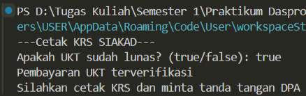

#### 2.1.3 Jawaban Pertanyaan / Pertanyaan Refleksi
* **Pertanyaan 1:** Nilai apa yang harus dimasukkan agar kedua baris di dalam blok `IF` ikut tercetak?
?
  * **Jawab:** `true` dan `false` karena kondisi pada blok `if` adalah boolean yang hanya dapat menyimpan true dan false
* **Pertanyaan 2:** Jalankan program, lalu masukkan `false`. Baris mana saja yang tercetak dan baris mana yang tidak? Jelaskan alur eksekusinya ketika kondisi `IF` bernilai `false`!
  * **Jawab:** Baris yang tercetak tidak ada karena tidak terdapat blok `false`/`else`. Alur eksekusinya adalah pertama program akan mengecek blok `if`. Karena inputnya `false` maka tidak sesuai dengan kondisi di blok `if` yang meminta `true`. Sehingga program tidak menampilkan pernyataan di dalam blok `if` dan langsung ke blok `else`. Namun, karena blok `else` tidak ada maka program tidak mencetak apa-apa'
  * 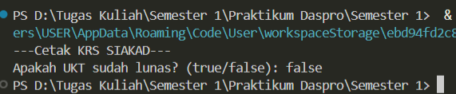
* **Pertanyaan 3:** Jalankan program, lalu masukkan `TRUE` (huruf kapital) dan `ya`. Apa yang terjadi pada masing-masing input? Jika program berhenti dengan error, jelaskan penyebabnya! 
  * **Jawab:** Jika dimasukkan `TRUE` program berjalan dengan normal karena tetap dianggap boolean `true`. Tetapi jika dimasukkan `ya` maka program error karena boolean hanya bisa menyimpan nilai `true` dan `false`, tidak bisa selain itu.
  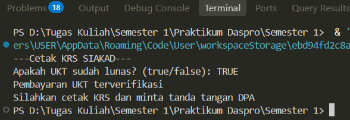
  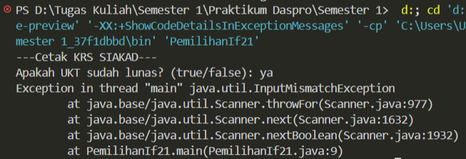
* **Pertanyaan 4:** Sistem perlu memberikan informasi apabila pengguna memasukkan nilai `false`, maka terdapat keluaran “Registrasi ditolak. Silakan lunasi UKT terlebih dahulu”. Modifikasi program tersebut dengan menambahkan struktur `ELSE`, lalu tunjukkan hasil run untuk
input `true` dan `false`! 
  * **Jawab:**
```java
import java.util.Scanner;

public class PemilihanIf21 {
    public static void main(String[] args) {
        Scanner sc = new Scanner(System.in);
            
        System.out.println("---Cetak KRS SIAKAD---");
        System.out.print("Apakah UKT sudah lunas? (true/false): ");
        boolean uktLunas = sc.nextBoolean();

        if (uktLunas) {
            System.out.println("Pembayaran UKT terverifikasi");
            System.out.println("Silahkan cetak KRS dan minta tanda tangan DPA");
        } else {
            System.out.println("Registrasi ditolak. Silahkan lunasi UKT terlebih dahulu");
        }
    }
}
```
Hasil run:
    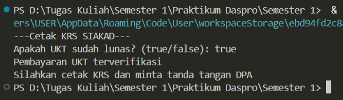
    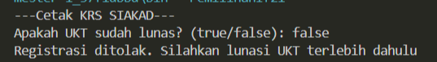

---

### 2.2 Percobaan 2: SWITCH-CASE untuk Mencetak KRS

Percobaan ini berfokus pada penggunaan `switch-case` untuk memilih menu atau opsi berdasarkan nilai yang bersifat spesifik.

#### 2.2.1 Tabel Pengujian Parameter Output

Berikut adalah hasil uji coba program dengan beberapa variasi masukan *Semester*:

| No | Input Parameter | Output yang Dihasilkan | Status Eksekusi |
| :---: | :--- | :--- | :---: |
| 1 | `Case 1` | "KRS semester 1 ditampilkan" | Valid |
| 2 | `Case 2` | "KRS semester 2 ditampilkan" | Valid |
| 3 | `case 3` | "KRS semester 3 ditampilkan" | Valid |
| 4 | `Case 4` | "KRS semester 4 ditampilkan" | Valid |
| 5 | `Case 5` | "KRS semester 5 ditampilkan" | Valid |
| 6 | `Case 6` | "KRS semester 6 ditampilkan" | Valid |
| 7 | `Case 7` | "KRS semester 7 ditampilkan" | Valid |
| 8 | `Case 9` | "KRS semester 8 ditampilkan" | Valid |
| 9 | `Default` | "Semester tidak valid" | Invalid |

#### 2.2.2 Program Java
```java
import java.util.Scanner;

public class PemilihanSwitch21 {
    public static void main(String[] args) {
     Scanner sc = new Scanner(System.in);
     
     System.out.println("---Cetak KRS SIAKAD---");
     System.out.print("Masukkkan semester saat ini: ");
     int semester = sc.nextInt();

     switch (semester) {
        case 1:
            System.out.println("KRS semester 1 ditampilkan");
            break;
        case 2:
            System.out.println("KRS semester 2 ditampilkan");
            break;
        case 3:
            System.out.println("KRS semester 3 ditampilkan");
            break;
        case 4:
            System.out.println("KRS semester 4 ditampilkan");
            break;
        case 5:
            System.out.println("KRS semester 5 ditampilkan");
            break;
        case 6:
            System.out.println("KRS semester 6 ditampilkan");
            break;
        case 7:
            System.out.println("KRS semester 7 ditampilkan");
            break;
        case 8:
            System.out.println("KRS semester 8 ditampilkan");
            break;
        default:
            System.out.println("Semester tidak valid");
     }
    }
}
```
#### 2.2.3 Jawaban Pertanyaan / Pertanyaan Refleksi
* **Pertanyaan 1:** Hapus perintah break; pada case 5, lalu compile dan jalankan kembali program dengan masukan 5. Tuliskan keluaran yang muncul, lalu jelaskan apa fungsi break pada struktur SWITCH-CASE berdasarkan hasil percobaan Anda! Kembalikan kode seperti semula setelah selesai.
  * **Jawab:**
```java
import java.util.Scanner;

public class PemilihanSwitch21 {
    public static void main(String[] args) {
     Scanner sc = new Scanner(System.in);
     
     System.out.println("---Cetak KRS SIAKAD---");
     System.out.print("Masukkkan semester saat ini: ");
     int semester = sc.nextInt();

     switch (semester) {
        case 1:
            System.out.println("KRS semester 1 ditampilkan");
            break;
        case 2:
            System.out.println("KRS semester 2 ditampilkan");
            break;
        case 3:
            System.out.println("KRS semester 3 ditampilkan");
            break;
        case 4:
            System.out.println("KRS semester 4 ditampilkan");
            break;
        case 5:
            System.out.println("KRS semester 5 ditampilkan");
        case 6:
            System.out.println("KRS semester 6 ditampilkan");
            break;
        case 7:
            System.out.println("KRS semester 7 ditampilkan");
            break;
        case 8:
            System.out.println("KRS semester 8 ditampilkan");
            break;
        default:
            System.out.println("Semester tidak valid");
     }
    }
}
```
  Hasil run:
  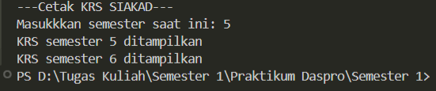
  Fungsi utama `break` pada switch-case adalah untuk menghentikan dan keluar dari blok pernyataan `switch` secara langsung setelah kode pada sebuah case selesai dijalankan.
* **Pertanyaan 2:** Jalankan program dengan masukan 10, lalu dengan masukan 0. Apa keluaran yang muncul pada kedua percobaan tersebut? Berdasarkan hasil itu, jelaskan peran default dan apa yang akan terjadi pada program jika bagian default dihapus!
  * **Jawab:** 
  Dengan Default:
  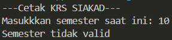
  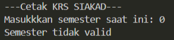
  Tanpa Default:
  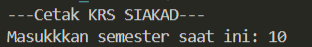
  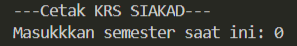
  Peran `default` adalah blok yang akan dirun jika input tidak sesuai dengan case manapun. Jika `default` dihapus program tetap berjalan tanpa error, tetapi jika dimasukkan input yang tidak sesuai dengan case manapun maka tidak akan ada blok yang dirun.
* **Pertanyaan 3:** Ganti tipe data variabel semester menjadi `double`, lalu compile programnya. Apakah program berhasil dicompile? Tuliskan pesan error yang muncul dan jelaskan penyebabnya. Sebutkan tipe data apa saja yang boleh digunakan sebagai ekspresi pada switch!
  * **Jawab:**
```java
import java.util.Scanner;

public class PemilihanSwitch21 {
    public static void main(String[] args) {
     Scanner sc = new Scanner(System.in);
     
     System.out.println("---Cetak KRS SIAKAD---");
     System.out.print("Masukkkan semester saat ini: ");
     double semester = sc.nextDouble();

     switch (semester) {
        case 1:
            System.out.println("KRS semester 1 ditampilkan");
            break;
        case 2:
            System.out.println("KRS semester 2 ditampilkan");
            break;
        case 3:
            System.out.println("KRS semester 3 ditampilkan");
            break;
        case 4:
            System.out.println("KRS semester 4 ditampilkan");
            break;
        case 5:
            System.out.println("KRS semester 5 ditampilkan");
            break;
        case 6:
            System.out.println("KRS semester 6 ditampilkan");
            break;
        case 7:
            System.out.println("KRS semester 7 ditampilkan");
            break;
        case 8:
            System.out.println("KRS semester 8 ditampilkan");
            break;
        default:
            System.out.println("Semester tidak valid");
     }
    }
}
```
  Hasil run:
  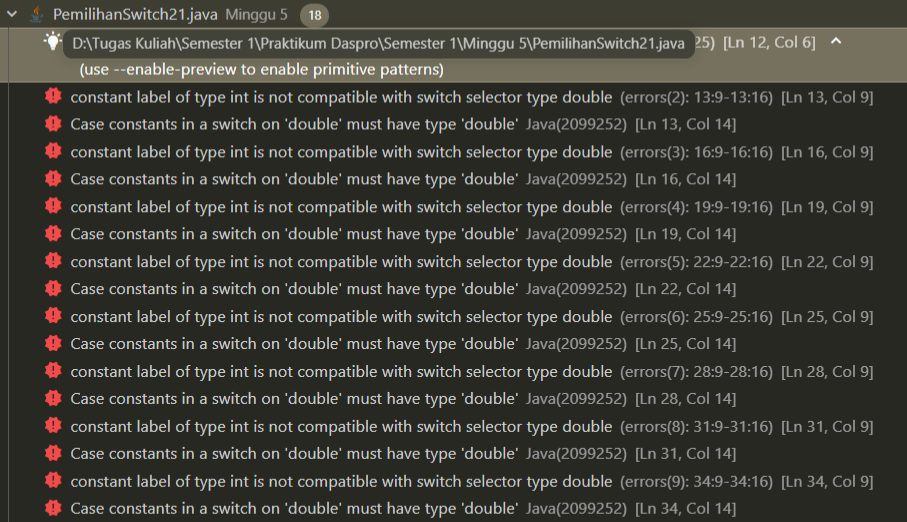
  Program tidak berhasil di compile, penyebabnya adakah switch case hanya bisa menerima nilai diskrit, sedangkan `double` dapat menyimpan nilai desimal dimana itu tidak diskrit. Tipe data yang bisa digunakan sebagai ekspresi dalam switch adalah `byte`, `short`, `interger`, dan `char`
* **Pertanyaan 4:** Buat file baru dengan nama PemilihanIfElseNoPresensi.java. Ubah program cetak KRS yang menggunakan SWITCH-CASE tersebut ke dalam bentuk IF-ELSE IF-ELSE, dengan ketentuan keluaran program harus sama persis dengan versi SWITCH-CASE, termasuk untuk masukan yang tidak valid. Menurut Anda mana yang lebih mudah dibaca untuk kasus ini, dan mengapa? 
  * **Jawab:**
```java
import java.util.Scanner;

public class PemilihanIfElse21 {
    public static void main(String[] args) {
        Scanner sc = new Scanner(System.in);
     
        System.out.println("---Cetak KRS SIAKAD---");
        System.out.print("Masukkkan semester saat ini: ");
        int semester = sc.nextInt();

        if (semester == 1) {
            System.out.println("KRS semester 1 ditampilan");
        } else if (semester == 2 ) {
            System.out.println("Krs semester 2 ditampilkan");
        } else if (semester == 3) {
            System.out.println("KRS semester 3 ditampilkan");
        } else if (semester == 4) {
            System.out.println("KRS semester 4 ditampilkan");
        } else if (semester == 5) {
            System.out.println("KRS semester 5 ditampilkan");
        } else if (semester == 6) {
            System.out.println("KRS semester 6 ditampilkan");
        } else if (semester == 7) {
            System.out.println("KRS semester 7 ditampilkan");
        } else if (semester == 8) {
            System.out.println("KRS semester 8 ditampilkan");
        } else {
            System.out.println("Semester tidak valid");
        }
    }
}
```
Menurut saya di program ini yang lebih mudah dibaca adalah bentuk SWITCH-CASE karena kondisinya terlihat jelas langsung di `case` sehingga program terlihat lebih rapi dan enak dilihat.

---

## 3: TUGAS MANDIRI

Berikut adalah daftar tugas yang dikerjakan pada Jobsheet ini:

- [x] **Tugas 1:** Mengubah struktur `if-else` menjadi *Ternary Operator*.
- [x] **Tugas 2:** Membuat program berdasarkan *Flowchart* penentuan SKS.
- [x] **Tugas 3:** Mengimplementasikan studi kasus parkir & antrean.

### 3.1 Implementasi Kode Tugas
#### - Tugas 1
Ternary operator bagusnya digunakan ketika hanya ada satu pernyataan pendek di blok `if` dan `else` sehingga program lebih pendek karena hanya akan menjadi satu baris saja.
```java
import java.util.Scanner;

public class PemilihanIf21Tugas {
    public static void main(String[] args) {
        Scanner sc = new Scanner(System.in);
            
        System.out.println("---Cetak KRS SIAKAD---");
        System.out.print("Apakah UKT sudah lunas? (true/false): ");
        boolean uktLunas = sc.nextBoolean();   

        String pesan = uktLunas ? "Pembayaran UKT terverifikasi\nSilahkan cetak KRS dan minta tanda tangan DPA" : "Registrasi ditolak. Silahkan lunasi UKT terlebih dahulu" ; 
        System.out.println(pesan);
    }
}
```

#### - Tugas 2
 ```java
import java.util.Scanner;

public class TugasNo2 {
    public static void main(String[] args) {
        Scanner sc = new Scanner(System.in);
            
        System.out.println("---Validasi jumlah SKS---");
        System.out.print("Masukkan jumlah SKS: ");
        int jumlahSks = sc.nextInt();

        if (jumlahSks > 24) {
            System.out.println("Melebihi batas");
        } else {
            System.out.println("KRS Valid");
        }
    }
}
```
#### - Tugas 3
Tugas Parkir
```java
import java.util.Scanner;

public class TugasParkir21 {
    public static void main(String[] args) {
        Scanner sc = new Scanner(System.in);

        int tarifParkir;
        System.out.print("Masukkan lama parkir (jam): ");
        byte jam = sc.nextByte();

        if (jam <= 2) {
            tarifParkir = 2000;
        } else {
            tarifParkir = 2000 + 1000 * (jam - 2);
        }
        System.out.println("Tarif parkir adalah: " +tarifParkir);
    }
}
```
Tugas Antrean
```java
import java.util.Scanner;

public class TugasAntrean21 {
    public static void main(String[] args) {
        Scanner sc = new Scanner(System.in);
        System.out.print("---Mesin Antrean Digital---\n(1)Legalisir Ijazah\n(2)Surat Keterarangan Aktif Kuliah\n(3)Pembayaran UKT\n(4)Pengajuan Cuti Akademik\nMasukkan kode layanan: ");
        byte kode = sc.nextByte();

        switch (kode) {
            case 1: 
            System.out.println("---Loket---\nSilahkan mengantri di loket A (Legalisir Ijazah)");
            break;
            case 2:
            System.out.println("---Loket---\nSilahkan mengantri di loket B (Surat Keterangan Aktif Kuliah)");
            break;
            case 3:
            System.out.println("---Loket---\nSilahkan mengantri di loket C (Pembayaran UKT)");
            break;
            case 4:
            System.out.println("---Loket---\nSilahkan mengantri di loket D (Pengajuan Cuti Akademik)");
            break;
            default: 
            System.out.println("Kode layanan tidak valid");
        } 
    }
}
```

---

## 4: KESIMPULAN

Secara singkat, struktur pemilihan sangat penting digunakan untuk mengatur alur jalannya program berdasarkan variabel atau pilihan yang ditentukan oleh pengguna. Setiap struktur pemilihan memiliki fungsinya masing-masing, gunakan struktur yang sesuai dengan program yang akan dibuat.

## 5: TUGAS DI LUAR JOBSHEET (LMS)
Berikut adalah daftar tugas yang dikerjakan pada LMS:

- [x] **Tugas 1:** Nusantara Pay — Sistem Keamanan Transaksi
- [x] **Tugas 2:** UGD RS Harapan Kita — Alokasi Ruang Darurat
- [x] **Tugas 3:** Konsultan Pajak — Kalkulator PPh 21 Progresif

### 5.1 Implementasi Kode Tugas
#### - Tugas 1
```java
import java.util.Scanner;

public class NusantaraPay {
    public static void main(String[] args) {
        Scanner sc = new Scanner(System.in);

        System.out.println("---Nusantara Pay---");
        System.out.println("Masukkan Status Nasabah (BLACK-LISTED/SUSPICIOUS/SAFE)");
        String statusAkun = sc.nextLine();
        System.out.print("Masukkan Sisa Saldo: ");
        long saldo = sc.nextLong();
        System.out.print("Masukkan jumlah transaksi: ");
        long transaksi = sc.nextLong();
        System.out.print("Apakah beda negara? (true/false): ");
        boolean isBedaNegara = sc.nextBoolean();
        System.out.print("Masukkan jam saat transaksi dilakukan (00,00-23,59(Gunakan pemisah koma)): ");
        float jam = sc.nextFloat();

        System.out.println("---Status Transaksi Anda---");
        if (statusAkun.equalsIgnoreCase("BLACK-LISTED")) {
            System.out.println("REJECTED_BLACKLIST");
        } else if (transaksi > saldo) {
            System.out.println("REJECTED_SALDO");
        } else if (transaksi > 10000) {
            System.out.println("REJECTED_LIMIT");
        } else if (isBedaNegara && transaksi > 2000) {
            System.out.println("FLAGGED_FRAUD");
        } else if (jam >= 0 && jam <= 4) {
            System.out.println("REQUIRE_OTP_NIGHT");
        } else if (statusAkun.equalsIgnoreCase("SUSPICIOUS") && transaksi > 500) {
            System.out.println("REQUIRE_OTP_SUSPICIOUS");
        } else {
            System.out.println("APRROVED");
        }
    }
}
```
#### - Tugas 2
```java
import java.util.Scanner;

public class AlokasiRuangDarurat {
    public static void main(String[] args) {
        Scanner sc =  new Scanner (System.in);

        System.out.println("---Alokasi Ruang Darurat---");
        System.out.print("Masukkan usia pasien: ");
        byte usia = sc.nextByte();
        System.out.println("Masukkan SpO2 pasien (%)");
        System.out.print("Masukkan dalam SpO2 rentang 1-100: ");
        byte spo2 = sc.nextByte();
        System.out.print("Masukkan tekanan darah sistolik pasien: ");
        short tekananDarahSistolik = sc.nextShort();
        System.out.print("Masukkan suhu tubuh pasien (°C): ");
        byte suhuTubuh = sc.nextByte();
        System.out.print("Masukkan laju napas pasien permenit: ");
        byte lajuNapas = sc.nextByte();
        System.out.print("Apakah pasien memiliki riwayat komorbid? (true/false): ");
        boolean riwayatKomorbid = sc.nextBoolean();
        System.out.print("Apakah pasien sadar penuh? (true/false): ");
        boolean isSadar = sc.nextBoolean();
        System.out.print("Masukkan sisa tempat tidur ICU: ");
        int sisaBedICU = sc.nextInt();

        System.out.println("---Lokasi Perawatan Pasien---");
        if (spo2 < 85 && sisaBedICU > 0 ) {
            System.out.println("ICU");
        } else if (spo2 < 85 && sisaBedICU == 0) {
            System.out.println("UGD Ventilator Mobil");
        } else if (spo2 >= 85 && spo2 <90 || tekananDarahSistolik < 90 || tekananDarahSistolik > 180 || !isSadar) {
            System.out.println("Resusitasi UGD");
        } else if ((spo2 >= 90 && spo2 <95 || suhuTubuh > 39) && riwayatKomorbid && usia >= 65 ){
            System.out.println("HCU Isolasi");
        } else if (spo2 >= 90 && spo2 <95 || lajuNapas > 24) {
            System.out.println("Rawat Inap Umum");
        } else {
            System.out.println("Rawat Jalan");
        }
    }
}
```
#### - Tugas 3
```java
import java.util.Scanner;

public class KalkulatorPPh21Progresif {
    public static void main(String[] args) {
        Scanner sc = new Scanner(System.in);

        System.out.println("---Kalkulator PPh21---");
        System.out.print("Masukkan PKP: ");
        double pkp = sc.nextDouble();
        double pph;

        if (pkp <= 0) {
            pph = 0;
        } else if (pkp <= 60000000) {
            pph = 0.05 * pkp;
        } else if (pkp <= 250000000) {
            pph = (0.05 * 60000000) + (0.15 * (pkp - 60000000));
        } else if (pkp <= 500000000){
            pph = (0.05 * 60000000) + (0.15 * 190000000) + (0.25 * (pkp - 250000000));;
        } else {
            pph = (0.05 * 60000000) + (0.15 * 190000000) + (0.25 * 250000000) + (0.3 * (pkp - 500000000));
        } 
        System.out.println(String.format("---Pajak yang harus dibayarkan---\nRp %.2f",pph));
    }
}
```
